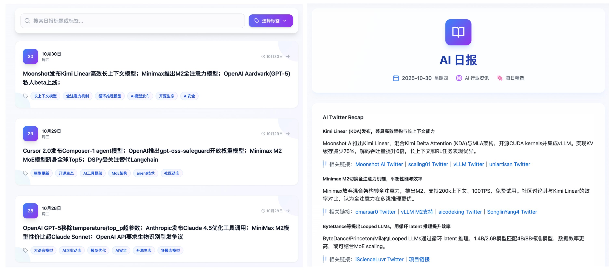

  <h3>🚀 Easy AI - 让 AI 学习变得简单</h3>
  
让复杂的 AI 概念变得触手可及，为开发者和学习者提供最优质的 AI 知识资源

## ✨ 项目简介

Easy AI 是一个专注于 AI 教育的现代化 Web 应用平台，旨在通过简洁直观的方式帮助用户理解复杂的人工智能概念。平台集成了多个学习模块，提供从基础概念到实践应用的全方位 AI 知识体系。

## 🎯 核心功能

### 📚 AI 知视：轻松理解各种 AI 相关概念

| 分类 | 主题内容 | 状态 |
|------|----------|------|
| 模型基础 | **[轻松理解 NLP](https://mmh1.top/#/ai-knowledge/nlp)** - 人工智能中处理自然语言的分支 | ✅ |
| 模型基础 | **[轻松理解 Transformer](https://mmh1.top/#/ai-knowledge/transformer)** - 自注意力架构，高效处理长文本 | ✅ |
| 模型基础 | **[轻松理解 LLM](https://mmh1.top/#/ai-knowledge/llm)** - 革命性的人工智能技术，重新定义机器理解能力 | ✅ |
| 模型基础 | **[轻松理解 模型蒸馏](https://mmh1.top/#/ai-knowledge/distill)** - 将复杂大模型知识压缩到轻量小模型的技术 | ✅ |
| 模型基础 | **[轻松理解 模型量化](https://mmh1.top/#/ai-knowledge/quantization)** - 将模型权重转换为较低精度表示的技术 | ✅ |
| 模型基础 | **[轻松理解 模型幻觉](https://mmh1.top/#/ai-knowledge/illusion)** - 模型在生成文本时出现的不真实、不合理的现象 | ✅ |
| 模型基础 | **[轻松理解 Token](https://mmh1.top/#/ai-knowledge/token)** - 模型在生成文本时的最小单位，每个 Token 代表一个词或词的一部分 | ✅ |
| 模型基础 | **[轻松理解 BERT](https://mmh1.top/#/ai-knowledge/bert)** - 基于 Encoder-Only 架构的预训练语言模型 | ✅ |
| 模型基础 | **[轻松理解 多模态](https://mmh1.top/#/ai-knowledge/multimodality)** - 让AI理解和生成图片、视频、音频等多种模态数据 | ✅ |
| 模型基础 | **[轻松理解 T5](https://mmh1.top/#/ai-knowledge/t5)** - 基于 Encoder-Decoder 架构的预训练语言模型 | ✅ |
| 模型基础 | **[轻松理解 GPT](https://mmh1.top/#/ai-knowledge/gpt)** - 基于 Decoder-Only PLM 架构的预训练语言模型 | ✅ |
| 模型基础 | **[轻松理解 LLaMA](https://mmh1.top/#/ai-knowledge/llama)** - 基于 Decoder-Only 架构的预训练语言模型 | ✅ |
| 模型基础 | **[轻松理解 DeepSeek R1](https://mmh1.top/#/ai-knowledge/deepseek-r1)** - 通过创新算法让大语言模型获得强大推理能力 | ✅ |
| 模型基础 | **[轻松理解 GGUF](https://mmh1.top/#/ai-knowledge/gguf)** - 实现更高效模型存储、加载和部署的格式 | ✅ |
| 模型基础 | **[轻松理解 MoE]()** - 即将到来 | 👷 |
| 模型部署 | **[轻松理解 模型部署](https://mmh1.top/#/ai-knowledge/deployment)** - 对比 Ollama 和 VLLM 两大主流本地部署方案 | ✅ |
| 模型训练 | **[轻松理解 预训练](https://mmh1.top/#/ai-knowledge/pretrain)** - 大语言模型训练的第一阶段 | ✅ |
| 模型微调 | **[轻松理解 为什么要微调](https://mmh1.top/#/ai-knowledge/whyfinetune)** - 长文本、知识库、微调的对比分析 | ✅ |
| 模型微调 | **[轻松理解 模型微调方法](https://mmh1.top/#/ai-knowledge/finetune)** - 全参数微调、LoRA微调、冻结微调对比 | ✅ |
| 模型微调 | **[轻松理解 SFT](https://mmh1.top/#/ai-knowledge/sft)** - 将预训练模型转化为实用AI助手的关键步骤 | ✅ |
| 模型微调 | **[轻松理解 LoRA](https://mmh1.top/#/ai-knowledge/lora)** - 当前最受欢迎的大模型高效微调方法之一 | ✅ |
| 模型微调 | **[轻松理解 RLHF](https://mmh1.top/#/ai-knowledge/rlhf)** - 通过强化学习将人类的主观偏好转化为模型的客观优化目标 | ✅ |
| 模型微调 | **[轻松理解 微调参数：学习率](https://mmh1.top/#/ai-knowledge/lr)** - 决定模型参数调整幅度的关键参数 | ✅ |
| 模型微调 | **[轻松理解 微调参数：训练轮数](https://mmh1.top/#/ai-knowledge/epochs)** - 模型完整遍历训练数据集的次数 | ✅ |
| 模型微调 | **[轻松理解 微调参数：批量大小](https://mmh1.top/#/ai-knowledge/bs)** - 每次更新模型参数时的样本数量 | ✅ |
| 模型微调 | **[轻松理解 微调参数：Lora秩](https://mmh1.top/#/ai-knowledge/lora-rank)** - 决定模型微调时表达能力的关键参数 | ✅ |
| 模型微调 | **[轻松理解 DeepSpeed](https://mmh1.top/#/ai-knowledge/deepspeed)** - 深度学习优化库，可以简化分布式训练与推理过程 | ✅ |
| 模型微调 | **[轻松理解 Loss](https://mmh1.top/#/ai-knowledge/loss)** - 模型在训练过程中用于衡量预测值与真实值之间差异的指标 | ✅ |
| 模型评估 | **[轻松理解 模型评估](https://mmh1.top/#/ai-knowledge/evaluation)** - 评估模型性能的指标和方法 | ✅ |
| 数据增强 | **[轻松理解 MGA](https://mmh1.top/#/ai-knowledge/mga)** - 通过轻量级框架将现有语料系统重构为多样化变体 | ✅ |
| 提示词 | **[轻松理解 提示词工程]()** - 即将到来 | 👷 |
| Agent | **[轻松理解 Agent](https://mmh1.top/#/ai-knowledge/agent)** - 让 AI 不只是答题机器，而是会做事的智能体 | ✅ |
| Agent | **[轻松理解 Function Calling](https://mmh1.top/#/ai-knowledge/function-calling)** - 大语言模型与外部数据源、工具交互的重要方式 | ✅ |
| Agent | **[轻松理解 MCP](https://mmh1.top/#/ai-knowledge/mcp)** - 开放标准协议，解决 AI 模型与外部数据源交互难题 | ✅ |
| RAG | **[轻松理解 RAG](https://mmh1.top/#/ai-knowledge/rag)** - 检索增强生成技术，解决大语言模型事实性问题 | ✅ |
| RAG | **[轻松理解 向量嵌入]()** - 即将到来 | 👷 |
| RAG | **[轻松理解 知识图谱]()** - 即将到来 | 👷 |

> 💡 持续更新中 ...
---

### 🎓 AI 教程：结合实战案例的完整教程体系

| 分类 | 主题内容 | 状态 |
|------|----------|------|
| AI 入门 | **[建立AI整体认知 - AI 技术是如何演进的？](https://www.bilibili.com/video/BV1nbJmzqEQJ)** | ✅ |
| 模型部署 | **[教你搭建一个纯本地、可联网、带本地知识库的私人 DeepSeek](https://www.bilibili.com/video/BV1LYA8eCESA)** | ✅ |
| 模型微调 | **[如何把你的 DeePseek-R1 微调为某个领域的专家？（理论篇）](https://www.bilibili.com/video/BV1WQAUeVEuj)** | ✅ |
| 模型微调 | **[如何把你的 DeePseek-R1 微调为某个领域的专家？（实战篇）](https://www.bilibili.com/video/BV1s2AUe2EBq/)** | ✅ |
| 模型微调 | **[LLaMA Factory 微调教程（二）：入门和安装使用](https://www.bilibili.com/video/BV1oTEwzcEeZ/)** | ✅ |
| 模型微调 | **[LLaMA Factory 微调教程（二）：如何构建高质量数据集](https://www.bilibili.com/video/BV1MRMnz1EGW/)** | ✅ |
| 模型微调 | **[LLaMA Factory 微调教程（三）：如何调整微调参数及显存消耗](https://www.bilibili.com/video/BV1BaM8zHEgh)** | ✅ |
| 模型微调 | **[LLaMA Factory 微调教程（四）：如何观测微调过程及模型导出](https://www.bilibili.com/video/BV1GUKhzkEHA)** | ✅ |
| 模型微调 | **[LLaMA Factory 微调教程（完整版）：从零微调一个专属领域大模型](https://www.bilibili.com/video/BV1djgRzxEts)** | ✅ |
| 模型评估 | **[大模型评估入门，及业界主流测试基准](https://www.bilibili.com/video/BV1HnB7BjEAN/)** | ✅ |
| 模型评估 | **[垂直领域模型评估：一键生成测试集 + 自动化评估实践指南](https://www.bilibili.com/video/BV1CRrVB7Eb4)** | ✅ |
| 数据集 | **[想微调特定领域的模型，数据集究竟要怎么搞？](https://www.bilibili.com/video/BV1z9RLYWEjq/)** | ✅ |
| 数据集 | **[如何把领域文献批量转换为可供模型微调的数据集？](https://www.bilibili.com/video/BV1y8QpYGE57/)** | ✅ |
| 数据集 | **[使用 Easy Dataset 构造数据集实践教程](https://www.bilibili.com/video/BV1fyJhzHEb7/)** | ✅ |
| 数据集 | **[五个数据集构建实战案例](https://www.bilibili.com/video/BV1Rq1hBtEJa/)** | ✅ |
| Agent | **[MCP + 数据库，一种提高结构化数据检索精度的新方式](https://www.bilibili.com/video/BV12nRzYPEiK/)** | ✅ |
| Agent | **[全网最细，看完你就能理解 MCP 的核心原理！](https://www.bilibili.com/video/BV1LQocYjEVt)** | ✅ |
| Agent | **[MCP 比传统应用面临着更大的安全威胁！](https://mp.weixin.qq.com/s/MJ-T5Dtn9FxqjMhgdXX9Qw)** | ✅ |
| Agent | **[一期带你彻底搞懂 Agent Skills，从原理到实战！](https://www.bilibili.com/video/BV1GXzaByEEo/)** | ✅ |

> 💡 持续更新中 ...

---

### 🤖 AI 提示词：精选最优秀的 AI 提示词

精选各大 AI 平台优质提示词，了解 AI 提示词的精髓。

| [Manus](https://mmh1.top/#/ai-prompts?source=Manus) | [Cluely](https://mmh1.top/#/ai-prompts?source=Cluely) | [Cursor](https://mmh1.top/#/ai-prompts?source=Cursor) | [Lovable](https://mmh1.top/#/ai-prompts?source=Lovable) | [Devin](https://mmh1.top/#/ai-prompts?source=Devin) |
|----------|----------|----------|----------|----------|
| [dia](https://mmh1.top/#/ai-prompts?source=dia) | [Junie](https://mmh1.top/#/ai-prompts?source=Junie) | [Bolt](https://mmh1.top/#/ai-prompts?source=Bolt) | [Cline](https://mmh1.top/#/ai-prompts?source=Cline) | [Codex CLI](https://mmh1.top/#/ai-prompts?source=Codex%20CLI) |
| [Replit](https://mmh1.top/#/ai-prompts?source=Replit) | [RooCode](https://mmh1.top/#/ai-prompts?source=RooCode) | [Same.dev](https://mmh1.top/#/ai-prompts?source=Same.dev) | [Spawn](https://mmh1.top/#/ai-prompts?source=Spawn) | [Trae](https://mmh1.top/#/ai-prompts?source=Trae) |
| [v0](https://mmh1.top/#/ai-prompts?source=v0) | [VSCode](https://mmh1.top/#/ai-prompts?source=VSCode) | [Warp.dev](https://mmh1.top/#/ai-prompts?source=Warp.dev) | [Xcode](https://mmh1.top/#/ai-prompts?source=Xcode) | [Windsurf](https://mmh1.top/#/ai-prompts?source=Windsurf) |

---

### 🧭 AI 导航：精选 AI 工具和学习资源

汇聚优质AI工具资源，按分类精准导航，助力工作与创作效率提升。

| 分类名称 | 工具数量 | 分类名称 | 工具数量 |
|----------|----------|----------|----------|
| **[全部工具](https://mmh1.top/ai-navigation)** | 878+ | **[AI写作工具](https://mmh1.top/ai-navigation?category=AI写作工具)** | 100+ |
| **[AI视频工具](https://mmh1.top/ai-navigation?category=AI视频工具)** | 100+ | **[AI图像工具](https://mmh1.top/ai-navigation?category=AI图像工具)** | 69+ |
| **[AI设计工具](https://mmh1.top/ai-navigation?category=AI设计工具)** | 78+ | **[AI音频工具](https://mmh1.top/ai-navigation?category=AI音频工具)** | 75+ |
| **[AI对话聊天](https://mmh1.top/ai-navigation?category=AI对话聊天)** | 72+ | **[AI编程工具](https://mmh1.top/ai-navigation?category=AI编程工具)** | 65+ |
| **[AI训练模型](https://mmh1.top/ai-navigation?category=AI训练模型)** | 49+ | **[AI开发平台](https://mmh1.top/ai-navigation?category=AI开发平台)** | 43+ |
| **[AI搜索引擎](https://mmh1.top/ai-navigation?category=AI搜索引擎)** | 40+ | **[AI幻灯片](https://mmh1.top/ai-navigation?category=AI幻灯片)** | 36+ |
| **[AI办公工具](https://mmh1.top/ai-navigation?category=AI办公工具)** | 30+ | **[AI智能体](https://mmh1.top/ai-navigation?category=AI智能体)** | 19+ |
| **[AI语言翻译](https://mmh1.top/ai-navigation?category=AI语言翻译)** | 19+ | **[AI内容检测](https://mmh1.top/ai-navigation?category=AI内容检测)** | 16+ |
| **[AI法律助手](https://mmh1.top/ai-navigation?category=AI法律助手)** | 8+ | | |

> 💡 **提示**：点击分类名称可直接跳转到对应工具页面，支持URL分享和收藏特定分类。

---

### 🤖 AI 模型：全面的 AI 模型数据库

汇聚主流 AI 大模型信息，提供模型参数、能力特点、发布时间等关键数据，帮助你快速了解和对比各类 AI 模型。

| 功能特性 | 说明 |
|----------|------|
| **模型检索** | 支持按名称、公司、标签等多维度搜索筛选 |
| **模型对比** | 展示上下文窗口、最大输出、开源状态等核心参数 |
| **分类浏览** | 按公司分组或按发布时间排序浏览 |
| **实时更新** | 持续收录最新发布的 AI 模型信息 |

> 💡 **访问地址**：[AI 模型库](https://mmh1.top/#/ai-model)

---

### 📊 AI 评估：权威的 AI 评测基准数据库

收录 AI 领域主流评测基准，涵盖语言理解、推理能力、多模态、代码生成等多个维度，助力了解 AI 模型能力评估体系。

| 基准类型 | 示例基准 |
|----------|----------|
| **语言理解** | MMLU、GLUE、SuperGLUE、HellaSwag |
| **推理能力** | ARC-AGI-1、ARC-AGI-2、GSM8K、MATH |
| **数学推理** | FrontierMath、AIME、Olympiad Bench |
| **多模态** | MMMU、Video-MMMU、VQA |
| **代码生成** | HumanEval、MBPP、SWE-bench、SciCode |
| **智能体** | MCP-Atlas、GAIA、MLE-bench |

> 💡 **访问地址**：[AI 基准库](https://mmh1.top/#/ai-benchmark)

---

### 📰 AI 日报：精选最新 AI 行业动态和技术突破

精选各渠道 AI 一手新闻，每日汇总报告。

## AI 发展：AI 领域的关键大事件

精选 AI 领域的重大事件，让你梳理清楚 AI 发展脉络。

---

## 🤝 贡献指南

我们欢迎所有形式的贡献，包括但不限于：
- 🐛 报告 Bug
- 💡 提出新功能建议
- 📖 改进文档
- 🔧 提交代码修复

---

## 📞 联系我们 & 交流群

如有任何问题或建议，欢迎通过以下方式联系：
- 🌐 项目主页：[Easy AI](https://mmh1.top/)
- 📧 问题反馈：通过 Issues 页面提交
- 📞 交流群：[加入 AI 交流群](./public/imgs/qrcode.jpg)

---

  
🎯 让 AI 学习变得简单 | 🚀 让知识传播更高效

  
Made with ❤️ for the AI learning community

